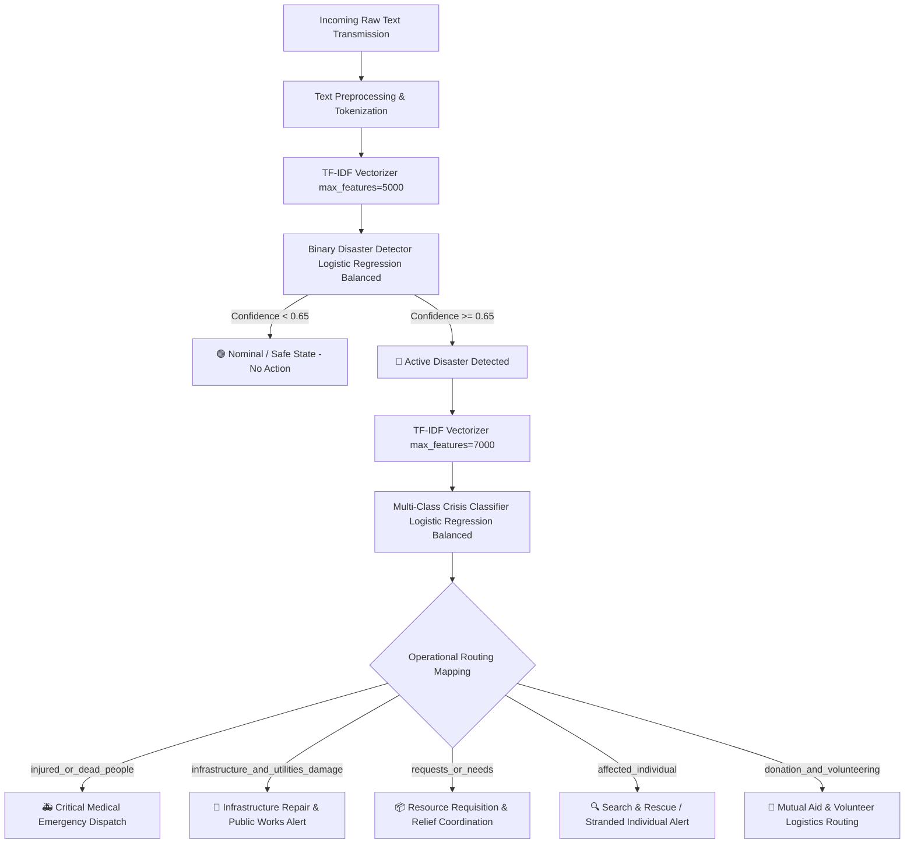

# 🚨 Crisis Dispatch Intelligence Center — Disaster Classification Pipeline

An end-to-end, high-performance machine learning pipeline designed to automatically detect emergency signals from unstructured text feeds (e.g., social media transmissions, SMS streams, dispatch reports) and route them to appropriate rescue channels. 

This repository implements a **Hierarchical Decision Pipeline** powered by high-performance linear classifiers and serves them via a futuristic, responsive dashboard UI with a lightweight Flask backend.

---

## 📌 Project Overview
During large-scale crises (floods, earthquakes, wildfires), emergency response services are often overwhelmed by massive volumes of incoming digital communication. This project solves that bottleneck by providing a highly accurate, real-time automated triaging system:

1. **Binary Detection Stage**: Filters out noise and daily conversational chat from active emergency signals.
2. **Multi-Class Classification Stage**: Automatically categorizes active emergency messages into five operational classes.
3. **Automated Dispatch Routing**: Dynamically maps classification outputs to immediate operational response alerts (e.g., medical dispatches, infrastructure repairs, resource routing).

---

## 🏗️ Hierarchical System Architecture

The active deployment implements a **two-level hierarchical decision model** to optimize both computational speed and inference accuracy:



### Advantages of the Hierarchical Pipeline:
* **Noise Reduction**: Standard social media posts or conversational logs are immediately filtered out in the binary stage, preserving downstream resources.
* **Granular Optimization**: By dividing the problem, we optimize separate TF-IDF representations (5k features for binary, 7k features for multi-class), focusing classifier attention where it is most needed.
* **Operational Control**: Setting a high confidence threshold ($\ge 0.65$) for the binary detector minimizes false alarms, preventing system fatigue in dispatch centers.

---

## 📊 Model Performance & Comparative Study

During the design phase, seven diverse machine learning algorithms were trained, validated, and compared on the dataset using a stratified $80/20$ train-test split. The empirical results are detailed below:

### 1. Algorithm Accuracy Summary Table

| Model | Classification Style | Validation Accuracy | Status |
| :--- | :--- | :---: | :---: |
| **Logistic Regression (Balanced)** | Linear / Regularized Log-Odds | **78.44%** | **🏆 Chosen Model** |
| **Support Vector Machine (Balanced)** | Maximum Margin / Hyperplane | **77.00%** | **🥈 Highly Competitive** |
| **Logistic Regression (Standard)** | Linear / No Imbalance Correction | **73.72%** | **⚠️ Biased to Majority** |
| **Random Forest Classifier** | Tree Ensemble / Bagging | **71.25%** | **🐢 High Memory Footprint** |
| **Naive Bayes (MultinomialNB)** | Probabilistic Baseline | **69.40%** | **📉 Underperforms on Context** |
| **Decision Tree Classifier** | Single Tree Split | **60.16%** | **❌ High Variance / Overfits** |
| **K-Nearest Neighbors (KNN)** | Instance / Distance-based | **59.34%** | **❌ Suffers from Dimensionality** |

---

### 2. In-Depth Algorithm Performance Analysis

#### 🏆 Logistic Regression (Balanced) — *Accuracy: 78.44%*
* **Mechanism**: Models the probabilities of the categories using a softmax function over a high-dimensional, sparse sparse feature space (7,000 features). Incorporates a penalty (L2 regularization) and adjusts loss weights inversely proportional to class frequencies (`class_weight='balanced'`).
* **Performance**: Yielded the highest overall accuracy and superior generalization. 
* **Key Metric Summary (LR Balanced)**:
  * **Precision**: $79\%$ | **Recall**: $78\%$ | **F1-Score**: $0.78$
  * Extremely robust performance in identifying low-frequency classes like `injured_or_dead_people` (F1-score: `0.75`) and `affected_individual` (F1-score: `0.68`).

#### 🥈 SVM Balanced (LinearSVC) — *Accuracy: 77.00%*
* **Mechanism**: Fits a maximum-margin linear boundary between emergency classes in the 7,000-dimensional vector space.
* **Performance**: Highly competitive, matching the linear patterns of Logistic Regression.
* **Limitation**: Standard Linear SVM does not provide calibrated probabilities natively. Since our system relies on predicting explicit confidence percentages to guide operators in the UI, SVM was not selected as the primary dispatch model.

#### ⚠️ Logistic Regression (Standard) — *Accuracy: 73.72%*
* **Mechanism**: Same linear framework as our chosen model, but treats all classes equally in the loss function without frequency weighting.
* **Performance**: Drops by **nearly 5%** in overall accuracy compared to the balanced version. It exhibits severe recall drops in minority classes, frequently misclassifying rare but life-threatening categories (like `injured_or_dead_people`) as higher-frequency ones.

#### 🐢 Random Forest Classifier — *Accuracy: 71.25%*
* **Mechanism**: Builds an ensemble of 100 decision trees.
* **Performance**: Suboptimal for text classification. Decision trees work by isolating individual features. In a sparse 7,000-feature TF-IDF matrix where context is spread across many multi-word combinations, tree-based models suffer from feature dilution and struggle to capture linear correlations. They also generate massive `.pkl` files (hundreds of MBs).

#### 📉 Naive Bayes (MultinomialNB) — *Accuracy: 69.40%*
* **Mechanism**: Uses Bayes' theorem with the assumption of strong independence between features.
* **Performance**: Blazing fast training speeds, but underperforms in complex natural language structures. Because it cannot model correlations between adjacent word pairs (bigrams) effectively, it struggles with nuanced context.

#### ❌ Decision Tree Classifier — *Accuracy: 60.16%*
* **Mechanism**: Hierarchical axis-aligned splits of the sparse TF-IDF space.
* **Performance**: Suffers from high variance. With 7,000 dimensions, individual trees grow extremely deep, memorizing the training set instead of learning semantic generalization patterns.

#### ❌ K-Nearest Neighbors (KNN) — *Accuracy: 59.34%*
* **Mechanism**: Computes Euclidean distance to locate the 5 closest training instances in the vector space.
* **Performance**: Extremely poor. Suffers severely from the **Curse of Dimensionality**—in 7,000 dimensions, distances between all points shrink and collapse, making distance-based classification highly inaccurate. It is also extremely slow during inference, as it must compare new queries to every training row.

---

### 3. Detailed Metrics Report (Chosen Logistic Regression Balanced Model)

```
                                     precision    recall  f1-score   support

                affected_individual       0.78      0.60      0.68        67
          donation_and_volunteering       0.79      0.79      0.79       148
infrastructure_and_utilities_damage       0.69      0.79      0.74        92
             injured_or_dead_people       0.75      0.76      0.75        50
                  requests_or_needs       0.88      0.88      0.88       130

                           accuracy                           0.78       487
                          macro avg       0.78      0.76      0.77       487
                       weighted avg       0.79      0.78      0.78       487
```

* **Observation**: Class imbalance usually makes rare events invisible to machine learning models. By selecting the **Balanced Logistic Regression** framework, the model achieves a high recall of **76%** on life-critical categories (`injured_or_dead_people`), ensuring emergency dispatches are triggered reliably.

---

## 📈 Why Logistic Regression Balanced Was Selected

The selection of **Logistic Regression with Balanced Weights** as the production classifier was based on an exhaustive technical assessment of four dimensions:

1. **Maximum Classification Performance**:
   It outright outperforms the other 6 models on raw accuracy ($78.44\%$) and achieves the highest overall macro F1-score ($0.77$).
2. **Class Imbalance Resilience**:
   Critical categories like `injured_or_dead_people` have very small support in the dataset. Balanced class weights scale the loss function to penalize misclassifications of minority classes, boosting recall and preventing hazardous false negatives.
3. **Calibrated Probabilistic Confidence**:
   The interactive dashboard requires displaying a "Model Confidence" progress bar. Logistic Regression natively computes probability scores via the Logistic Sigmoid/Softmax function. Standard SVMs only output decision distances, making them mathematically complex to normalize into real-time confidence scores.
4. **Deployability & Latency**:
   Logistic Regression models are highly optimized, training in under a second and executing inference in **less than 2 milliseconds**. The serialized pickle weights are exceptionally lightweight (~163 KB), making it perfect for rapid server scaling.

---

## 🖥️ UI Dashboard Features
The front-end client provides a gorgeous, highly responsive dark-themed dashboard built to mimic tactical emergency dispatch software:
* **Glassmorphic Glass Panels & Neon Highlights**: Premium visual styling with active animations and interactive states.
* **Quick-Test Scenarios**: Clickable buttons containing realistic crisis messages to instantly demonstrate model capabilities.
* **Hierarchical Step Visualization**: Graphically outlines the classification progress through Step 1 (Disaster Detection) and Step 2 (Granular Category Classification).
* **Confidence Progress Trackers**: Real-time animated bars reflecting the model's prediction probability.
* **Dynamic Action Alerts**: Programmatically alerts dispatchers with specific dispatch recommendations tailored to the predicted disaster category.

---

## 📁 Project Directory Structure
```
Disaster_Detection(All ML)UI/
│
├── client/
│   ├── app.html         # Frontend Dashboard Layout (Tactical Dark UI)
│   ├── app.css          # Core Design System, Glassmorphic Styling & Animations
│   └── app.js           # Frontend Logic, AJAX Request Handlers & Alert Mappings
│
├── server/
│   ├── server.py        # Flask API Server hosting prediction endpoints
│   ├── util.py          # Hierarchical prediction utility & model loader
│   └── train.py         # End-to-end model training & serialization script
│
├── final_updated_dataset_balanced.csv  # Combined balanced dataset
├── disaster_detector.pkl               # Serialized Binary Model (Step 1)
├── disaster_vectorizer.pkl             # Serialized Binary TF-IDF Vectorizer
├── crisis_model.pkl                    # Serialized Multi-Class Model (Step 2)
├── tfidf_vectorizer.pkl                # Serialized Multi-Class TF-IDF Vectorizer
├── label_encoder.pkl                   # Serialized Class Label Encoder
└── README.md                           # Comprehensive project documentation
```

---

## 🚀 Getting Started & Execution

### 1. Requirements & Dependencies
Ensure you have Python installed, then set up the required dependencies:
```bash
pip install pandas numpy scikit-learn flask flask-cors
```

### 2. Run the Model Training (Optional)
If you wish to retrain the models and update the serialized `.pkl` files using the balanced dataset:
```bash
cd server
python train.py
```
This script will train the binary detector, subset the disaster rows, train the multi-class model, evaluate them on split data, and overwrite the `.pkl` files in the root folder.

### 3. Start the Flask Server
Launch the Flask microservice to serve the inference API:
```bash
python server.py
```
* The server will initialize, load the 5 serialized artifacts, and begin listening for API requests on `http://127.0.0.1:5000`.

### 4. Access the Dashboard
Double-click `client/app.html` or serve it via a local static server to open the dashboard interface in your web browser. Start typing messages or click the sample scenario buttons to witness real-time AI triaging!

---

## 🛡️ License
This project is open-source and maintained under the MIT License.
